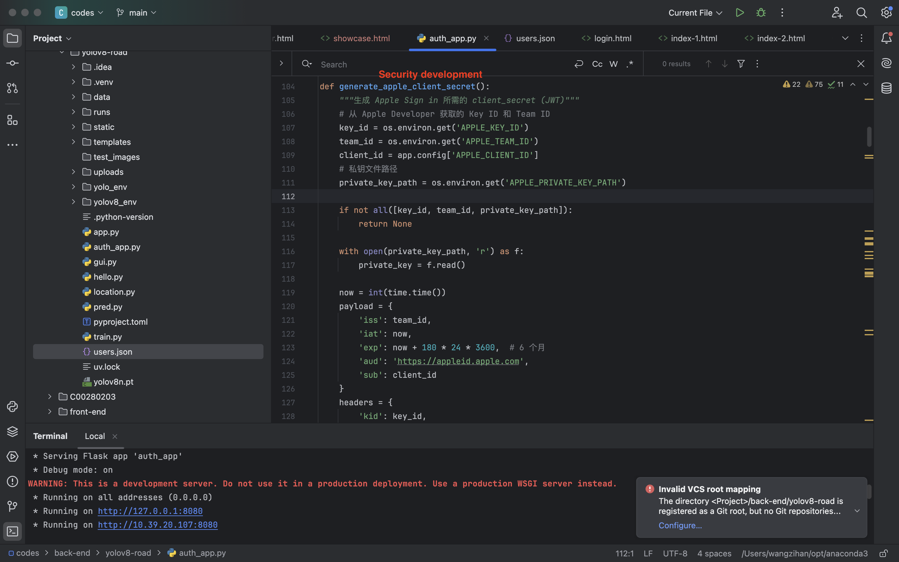
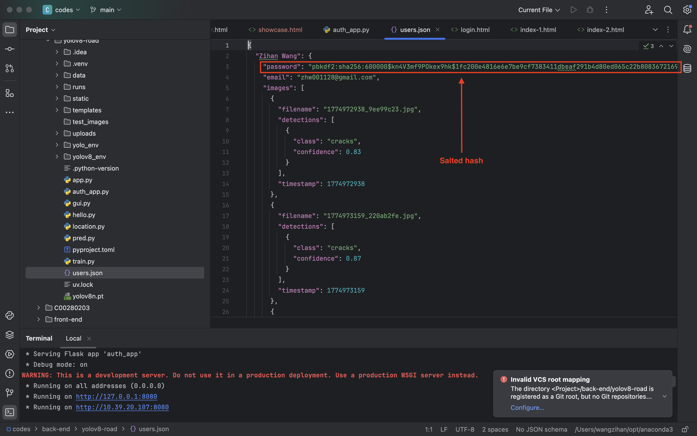
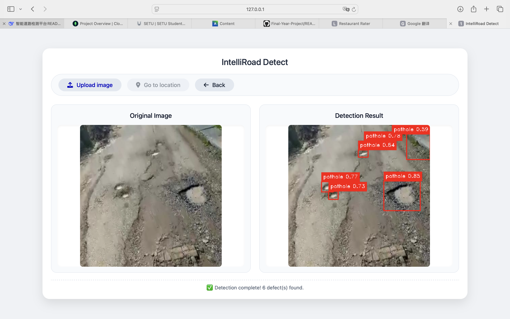
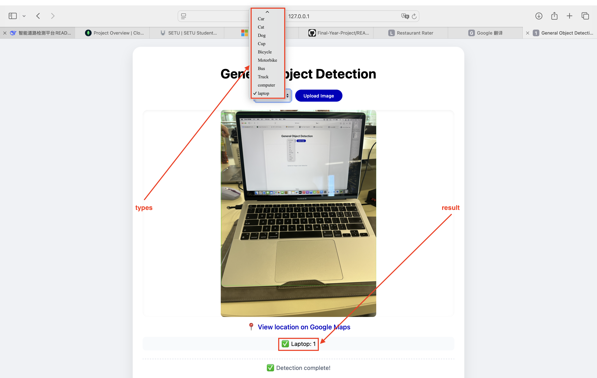
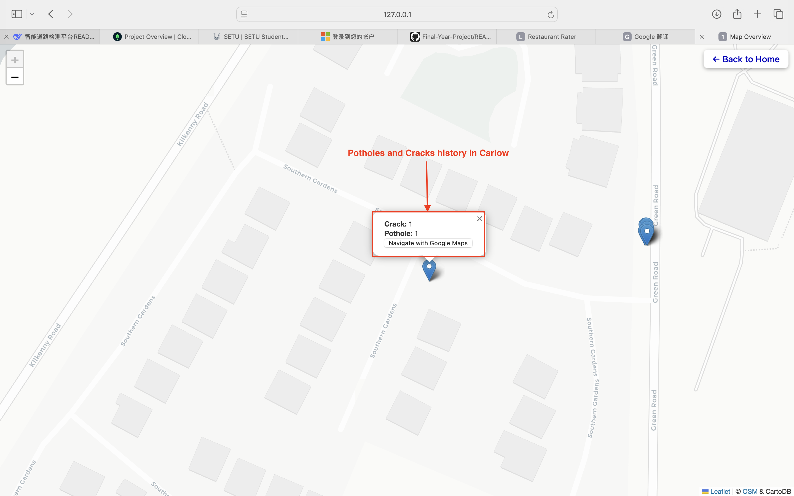
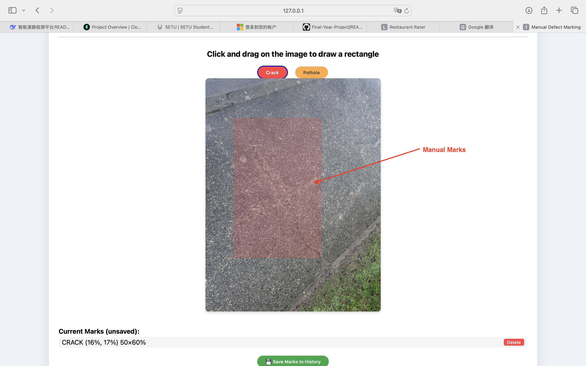
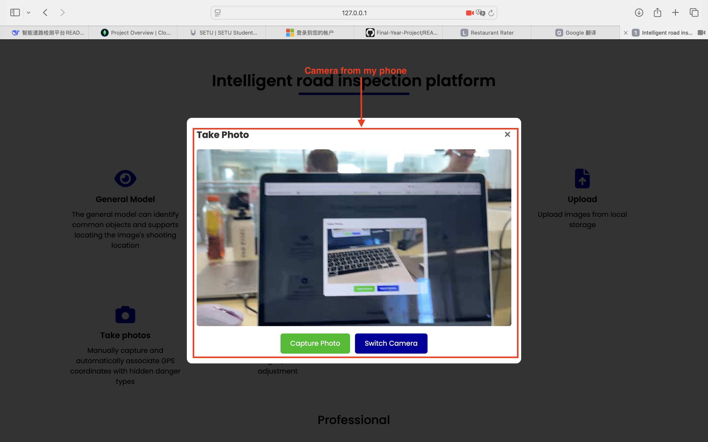
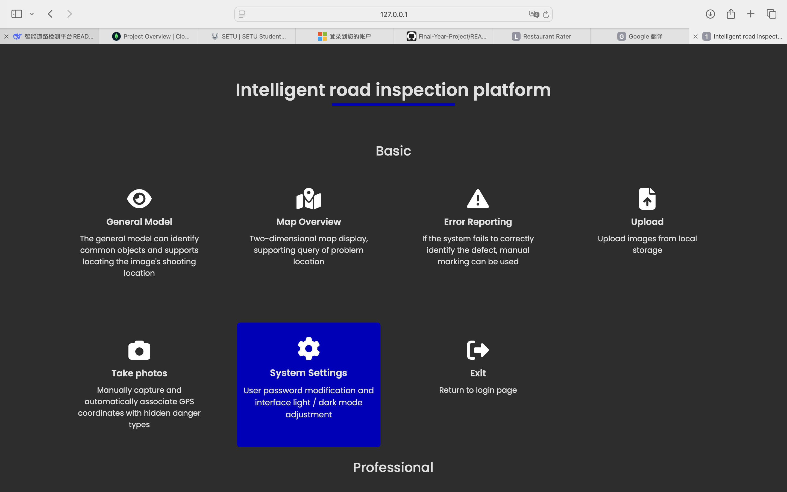
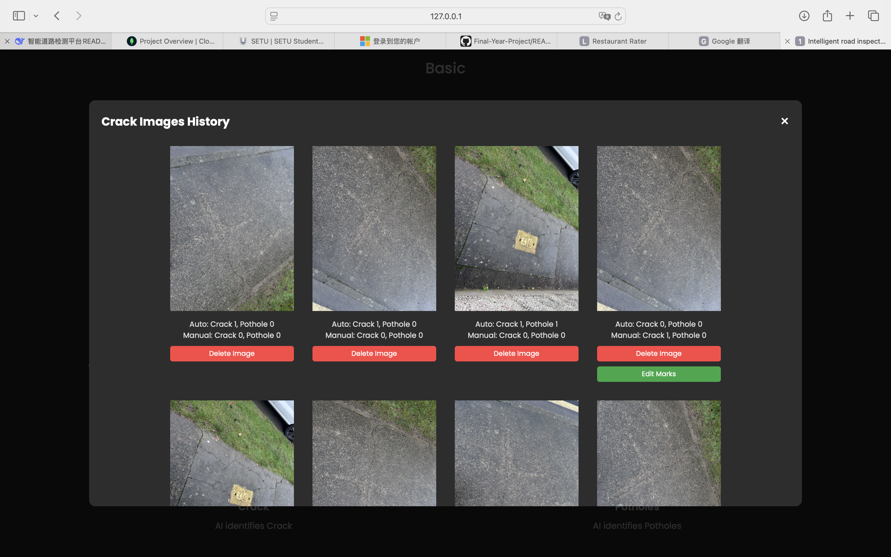
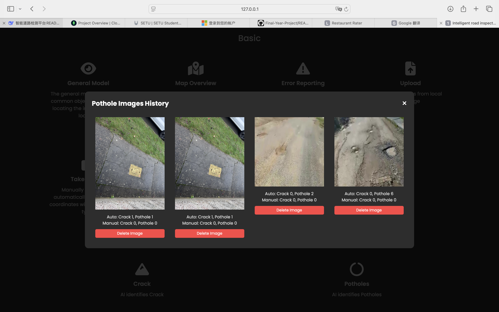

## Intelligent Road Inspection Platform
#### **Intelligent Road Crack and Pothole Detection System Based on YOLOv8**
#### Design and Implementation of Intelligent Road Inspection Platform  
##### **Author:** Zihan Wang
##### **Student ID:** C00280203
##### **Supervisor:** Jamal Tauseef
##### **Date:** 18/04/2026  

### Project Introduction
##### This graduation project constructs a complete intelligent road inspection web platform with a separated front-end and back-end. The system uses **YOLOv8** as its core, automatically identifying **cracks** and **potholes** in road surface images. Combined with GPS positioning, map visualization, manual annotation, and historical management functions, it provides road maintenance departments with an efficient and digital inspection tool.
##### The back-end uses **Python Flask** to provide a RESTful API, while the front-end uses native HTML/CSS/JavaScript and a **Leaflet** interactive map. It supports multi-source image input (local upload, camera capture) and implements security mechanisms such as user isolation, CSRF protection, and brute-force attack protection.

### Functional Modules

##### - 🔐 **User Authentication (M1)**
Local registration/login, password stored with salted hash; supports Google/Microsoft/Apple OAuth third-party login (demo function).




##### - 🧠 **Professional Road Surface Detection (M5)**
Uses a self-trained YOLOv8n model to identify cracks and potholes, returning result images with labeled bounding boxes and automatically saving detection records.


##### - 🌍 **General Object Detection (M2)**
Uses the official pre-trained YOLOv8n model, supports 80 categories of general object detection, which can be filtered by category to demonstrate the model's general capabilities.


##### - 🗺️ **Map Overview (M3)**
Automatically extracts GPS coordinates from the image's EXIF ​​data. Detection points are marked on the map using Leaflets. Clicking a marker displays defect statistics and redirects to Google Maps navigation.


##### - ✏️ **Manual Annotation (M4)**
Allows users to drag and draw rectangles on the image to manually supplement or correct missed/false detections in the model. Annotation data can be saved, edited, and deleted.


##### - 📸 **Camera Capture (M6)**
Supports using the device's camera to take photos and automatically associates them with GPS, demonstrating compatibility with multi-source image acquisition.
My phone's screen.


The server fetched from my phone


##### - ⚙️ **System Settings (M7)**
Dark/Light mode switching, password change.


##### - 📋 **History (M8)**
Browse historical detection images by crack/pit type, displaying automatic detection and manual annotation statistics, supporting image deletion and jumping to edit marks.
History of cracks


History of potholes


### Technology Stack
**Backend**: Python 3.10+, Flask, YOLOv8 (Ultralytics), OpenCV, Pillow
**Frontend**: Native HTML5/CSS3/JavaScript, Font Awesome, Leaflet, EXIFR
**Model**: YOLOv8n (self-trained crack/pit model + official pre-trained general model)
**Security**: Werkzeug password hashing, Session management, CSRF token, file header verification
**Data Storage**: JSON file (for demonstration purposes, can be migrated to SQLite/PostgreSQL)
**Authentication**: Local account + OAuth 2.0 (Google, Microsoft, Apple)

### Environment Configuration and Operation
#### 1. Environment Requirements
- **Python 3.10** or higher
- Virtual environment recommended: `python -m venv venv`

#### 2. Install Dependencies
```bash
install -r requirements.txt
```

#### 3. Place Model Weights
Ensure that the self-trained YOLOv8 weight file, best.pt, is located at:
```bash
runs/detect/yolov8n_v8_200e/weights/best.pt
```
The general model yolov8n.pt will be downloaded automatically on the first run.

#### 4. Configure Environment Variables (Optional)
The following environment variables should be set in the production environment. Developers can use the default values:
- SECRET_KEY: Flask key (default is dev-secret-key-change-in-production)
- OAuth related IDs/Secrets (currently a demo feature if third-party login is required):
```GOOGLE_CLIENT_ID```, ```GOOGLE_CLIENT_SECRET```
```MICROSOFT_CLIENT_ID```, ```MICROSOFT_CLIENT_SECRET```
```APPLE_CLIENT_ID```, ```APPLE_CLIENT_SECRET```, ```APPLE_KEY_ID```, ```APPLE_TEAM_ID```, ```APPLE_PRIVATE_KEY_PATH```

#### 5. Start the service
```bash
python auth_app.py
``` 
By default, it listens on http://0.0.0.0:8080. You can use it by opening it in your browser.

### Instructions for Use

1. Registration/Login 

    First-time users need to register a local account or log in via a third-party icon (demo). The session is valid for 2 hours after login.

2. Function Navigation 

    After logging in, you will enter the homepage (/index-1), which provides access to General Model, Map Overview, Manual Annotation, Upload Detection, Photo Capture, History, and System Settings.

3. Professional Road Surface Detection

    Click “Upload” → Select an image → The system automatically extracts GPS and calls a dedicated model for detection → Displays a comparison between the original image and the annotated results.

4. General Object Detection

    Go to “General Model” → Upload an image → You can select the target category from the dropdown menu for filtering detection.

5. Map Overview

    All detection records with GPS information will be displayed as markers. Click to view the number of defects and navigate.

6. Manual Annotation

    Select an existing image → Select the defect type → Drag and drop to draw a rectangle on the Canvas → Save to the server, or delete existing markers.

7. System Settings 

    Supports one-click switching between dark and light themes, and allows modification of account passwords.


### Security Design
✅ Password Security: Werkzeug automatic salting hash storage

✅ Session Security: HttpOnly Cookie, 2-hour timeout, SameSite='Lax'

✅ CSRF Protection: All POST requests except login/registration are validated with a CSRF token

✅ Brute-force Protection: Account locked for 15 minutes after 5 failed login attempts

✅ File Upload Security: File header Magic Number verification (JPEG/PNG/HEIC), path traversal protection, 16MB size limit

✅ User Data Isolation: All operations are resource-isolated based on Session username


### Future Work

- 🧠 Introduce more diverse training data and experiment with YOLOv8s/m/l or DETR architectures to improve accuracy.

- 🗄️ Migrate JSON storage to SQLite/PostgreSQL to support efficient queries and concurrency.

- 🚁 Integrate DJI SDK or PX4 to achieve automatic transmission and real-time detection of drone aerial images.

- 📄 Add automatic generation of detection reports, supporting statistical analysis by time period/region and exporting to PDF.

- ☁️ Containerize deployment to cloud servers to support multi-user collaborative inspection.


### References

- Ultralytics YOLOv8: https://github.com/ultralytics/ultralytics

- Flask Web Development, Grinberg M. (O'Reilly)

- Leaflet: https://leafletjs.com

- OWASP Top 10: 2021

- GDPR Compliance Reference